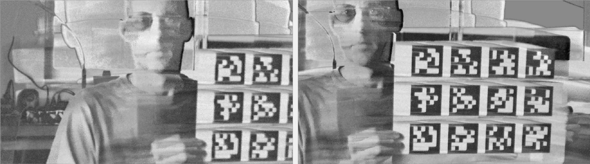

# event\_image\_reconstruction\_fibar

This repository contains a ROS package for event image reconstruction by
means of a temporal and spatial filtering algorithm
[described here](https://arxiv.org/abs/2510.20071). It depends
on the [fibar library](https://github.com/ros-event-camera/fibar_lib).



## Supported platforms

Continuous integration testing for ROS Humble and later distros.

## How to build

Set the following shell variables:

```bash
repo=event_image_reconstruction_fibar
url=https://github.com/ros-event-camera/${repo}.git
```

and follow the [instructions here](https://github.com/ros-misc-utilities/.github/blob/master/docs/build_ros_repository.md)

## About time synchronization and time stamps

The FIBAR algorithm reconstructs a brightness image event by event, and produces image frames for given frame times. This section explains how
these frame times are computed, and how they are synchronized with external sources.

First off, all frames are ultimately produced based on *sensor time*, that is, the time stamps generated by the camera's internal clock,
and affixed to each event individually.
However, when synchronizing against an external time source such as e.g. a camera, the time for which to reconstruct the frame will be
specified by the *host time* given in the ROS image message header stamp.
See the [event camera codecs repository](https://github.com/ros-event-camera/event_camera_codecs?tab=readme-ov-file#event-time-stamps)
for more details on sensor vs host time.
Since the sensor clock is not synchronized with the host clock, sensor time and host time have different starting points, and drift from each other.
For this reason, the event image reconstruction node constantly estimates the offset between sensor and host time, which allows it to then convert
host time to sensor time for frame generation.

### Offset and drift estimation

When ROS event camera packet messages arrive at the reconstruction node, the sensor time of the first event in the packet corresponds to the host time
provided by the ROS message header stamp.
Thus, for every arriving packet, the reconstruction node updates a running average offset between host time and sensor time, allowing for a two-way conversion
between host and sensor time. This is the conversion referred to below when writing "sensor time = estimated(host time)", meaning the sensor time is computed
from the host time by using the estimated offsets, and conversely, with some abuse of notation "host time = estimated(sensor time)" for deriving the
host time from the sensor time.

### Synchronization modes

Supported synchronization modes:

1) Free Running. The node generates its own frame times, *equidistant in sensor time*, and not synchronized to any external time sources.
2) Trigger Events. Many event cameras (notably the ones with Prophesee sensors) have an input pin that generates so-called "external trigger events"
   when a pulse signal arrives. These trigger events are time stamped to the arrival time of they pulse, and inserted into the event stream.
   When a trigger event is decoded by the reconstruction node, it will emit a frame based on the sensor time of the trigger event. The header stamp
   of the frame will be estimated from the trigger event's sensor time.
3) Camera Image. This mode supports synchronizing the event camera to a frame-based camera. If the sync pulse triggering the frame-based camera's image
   is not connected to the event camera, the header stamp of the camera image is converted to sensor time which is then used to reconstruct the frame.
   If a sync pulse is available, the reconstruction node can be configured to use the external trigger events as well, meaning the reconstruction
   is done based on the sensor time embedded in the external trigger event. The difference with respect to "Trigger Events" mode is that the header
   time stamp of the emitted image frame will be taken from the camera image header message, such that down-stream calibration packages can directly
   recognize which camera image frames belong to which reconstructed event image frames.
4) Time Reference. This mode allows for injection of arbitrary frame times via standard ROS TimeReference messages. The header stamp of the message will
   be used for the header stamp of the reconstructed frame, the ``time_ref`` field is expected to contain the sensor time for reconstruction. This mode
   is useful when two event cameras are connected with a sync cable, i.e. their sensor time is synchronized, and one (or both) are connected to an external
   trigger pulse. One of the reconstruction nodes is then configured to publish a TimeReference message (and also a reconstructed image frame), to which
   the reconstruction node for the other camera subscribes. This way the reconstructed frames of the two nodes will be based on the same sensor time, and
   will also carry identical ROS header stamps. If both cameras are connected to the same sync pulse, the node receiving the time reference message
   can be configured to ignore the sensor time of the message, and instead use the sensor time from external trigger events.

## Node Parameters

- ``sync_mode``: How to find the sensor time for reconstructing frames. See [Synchronization Modes](#synchronization-modes)
  and the sync table below for possible values. Default: ``free_running``.
- ``use_trigger_events``: Set this to true to use external trigger events in the event data stream.
  See [Synchronization Modes](#synchronization-modes) and the sync table below. Default: False.
- ``fps``: Frequency (in hz) at which images are reconstructed in free running mode. Default: 25.
- ``cutoff_num_events``: The cutoff period (in number of events) for the reconstruction algorithm.
  See [the FIBAR paper](https://arxiv.org/abs/2510.20071). Default: 40
- ``use_spatial_filter``: whether to use spatial filtering ([FIBAR](https://arxiv.org/abs/2510.20071)). Default: ``true``.
- ``statistics_period``: Time period in seconds between statistics printouts. Default: 5.
- ``event_queue_memory_limit``: How many bytes of event data to keep in the incoming queue before dropping data. Default: 10MB.
- ``ros_event_queue_size``: Number of event packet messages to keep in the ROS receive queue. Default: 1000.
- ``edge``: Whether to use the ``up`` or ``down`` edge of the hardware trigger signal. Default: ``up``.
- ``frame_path``: output directory for reconstructed frames and frame-based camera images. Set to empty string to suppress frame writing. Default: ``""``.
- ``publish_time_reference``: whether to publish time reference message. Default: ``false``.

|``sync_mode``     |``use_trigger_events``| frame time source | ROS header time stamp | note |
|------------------|----------------------|-------------------|-----------------------|------|
|``free_running``  | false        | sensor clock                  | estimated(sensor time) ||
|``free_running``  | true         | INVALID CONFIG                | INVALID CONFIG         ||
|``trigger_events``| false        | INVALID CONFIG                | INVALID CONFIG         ||
|``trigger_events``| true         | external trigger              | estimated(sensor time)||
|``camera_image``  | false        | estimated(image.header.stamp) | image.header.stamp||
|``camera_image``  | true         | external trigger              | image.header.stamp||
|``time_reference``  | false      | estimated(ref.header.stamp)   | ref.header.stamp||
|``time_reference``  | true       | external trigger              | ref.header.stamp||

## Node Topics

Publishers:

- ``~/image``: the reconstructed image frame

Subscribers:

- ``~/events``: input event camera events (includes external triggers!)
- ``~/frame_image``: image of frame-based camera for synchronization (hardware or software)
- ``~/time_reference``: time reference for synchronization (hardware or software)

## How to use

This ROS node takes events from an event camera running a ROS driver, and reconstructs a log(intensity) image
from it. Here are several usage examples.

1) Free-running mode. This means there is no synchronization, and the produced frames will be at a fixed
   frame rate, equidistant in sensor time (not ROS or system time).
2) Software synchronized with external camera. The reconstruction node subscribes to a camera topic. When an image frame
   arrives, it translates the ROS header time stamp of the image message to sensor time using its internally
   estimated offset between sensor time and ROS time. This sensor time is then used for image reconstruction.
3) Hardware synchronized with external trigger (currently Metavision-based cameras only).
   This requires a trigger-in hardware sync pulse to be sent to the event camera whenever a frame-based camera frame is triggered.
   The reconstruction node will use the trigger event's sensor time to reconstruct the intensity image,
   then translate the trigger time to ROS time to look up the corresponding header stamp of the frame-based camera image
   that likely corresponds to this trigger event. This header stamp will be used for the published reconstructed image.
4) Stereo camera, with time synchronization cable between two event cameras, but no external trigger signal connected.
   Node 0 is free running and publishes a time reference message that node 0 is subscribing to.
5) Stereo camera, with time synchronization cable between two event cameras that are both connected to an external trigger signal.
   Node 1 publishes a time reference message based on arriving external trigger events, node 0 subscribes to time reference
   messages and uses those to determine the ROS header stamp of its published reconstructed frames,
   but it uses the sensor time stamps from its own external trigger messages.

The topics in the below example must be adjusted to work for the specific setup.
As for any ROS-based project, check that the topics are connected correctly by using ``ros2 node list``, ``ros2 node info`` and ``ros2 topic list``.
Also bear in mind that the FIBAR node operates with lazy subscribe.
In order for it to do anything, you *must subscribe to the reconstructed image* (rqt\_gui is good tool for that)

In all the below cases ``use_sim_time`` is set to ``true`` because it is assumed that the data is played back from a rosbag that drives the clock:

```bash
ros2 bag play --clock-topics-all my_bag_with_data
```

The launch files used in the examples below assume a certain convention for the event topic naming. Your rosbag should have
the topics named like this (or else you have to hack the launch files):

```text
Topic information: Topic: /event_cam_0/camera/events | Type: event_camera_msgs/msg/EventPacket
                   Topic: /event_cam_1/camera/events | Type: event_camera_msgs/msg/EventPacket

```

### Example launch for case 1

Free-running (unsynchronized) mode, writing frames, with data played back from rosbag:

```bash
ros2 launch event_image_reconstruction_fibar fibar.launch.py camera_name:=event_cam_0 fps:=15 use_sim_time:=true
```

### Example launch for case 2

Software synchronized with camera frames with data played back from rosbag:

```bash
ros2 launch event_image_reconstruction_fibar fibar.launch.py camera_name:=event_cam_0 frame_image:=/cam_sync/cam0/image_raw sync_mode:=camera_image use_sim_time:=true
```

### Example launch for case 3

Hardware-synced setup, triggering on the up edge of the signal.

```bash
ros2 launch event_image_reconstruction_fibar fibar.launch.py camera_name:=event_cam_0 frame_image:=/cam_sync/cam0/image_raw sync_mode:=camera_image use_trigger_events:=true trigger_edge:=up use_sim_time:=true
```

In this hardware synchronized case, the FIBAR node will output statistics showing event rate, frame-based camera rate, and trigger event rate. The frame-based camera rate and trigger rate must be very close for the frame-to-trigger association to work. The last column gives the estimated time delay of the trigger event with respect to the frame-based camera image. In this (unusual) example the delay is positive, meaning the camera frame time stamp is *earlier* than the event trigger time.

```text
[INFO] [1764937150.578530550] [event_cam_0.fibar]:   7.27(  7.27) Mevs, lag:  0.0000s frm:  37.99( 38.35)Hz trig:  37.99( 38.10)Hz del:  3.060ms
[INFO] [1764937155.578969871] [event_cam_0.fibar]:   7.55(  7.55) Mevs, lag:  0.0000s frm:  38.20( 38.22)Hz trig:  38.20( 38.09)Hz del:  3.061ms
```

### Example launch for case 4

Two event cameras connected with sync cable, but no external trigger pulse connected. Free-running node 0 publishes time reference messages for node 1.

```bash
ros2 launch event_image_reconstruction_fibar fibar_stereo.launch.py use_sim_time:=true cam_0_camera_name:=event_cam_0  cam_0_sync_mode:=free_running cam_0_publish_time_reference:=true cam_1_camera_name:=event_cam_1 cam_1_sync_mode:=time_reference cam_1_time_reference:=/event_cam_0/fibar/time_reference
 ```

The output shows that both cameras do not use trigger events:

```text
[INFO] [1764937423.207856455] [event_cam_1.fibar]:   7.14(  7.14) Mevs, lag:  0.0000s frm:  25.00( 25.00)Hz trig:   0.00( -1.00)Hz del:  0.000ms
[INFO] [1764937423.207871754] [event_cam_0.fibar]:   7.53(  7.53) Mevs, lag:  0.0000s frm:  25.00( 25.00)Hz trig:   0.00( -1.00)Hz del:  0.000ms
```

### Example launch for case 5

Two hardware-synced event cameras, with node 1 publishing the trigger event messages for node 0.

```bash
ros2 launch event_image_reconstruction_fibar fibar_stereo.launch.py use_sim_time:=true cam_0_camera_name:=event_cam_0  cam_0_sync_mode:=time_reference cam_0_time_reference:=/event_cam_1/fibar/time_reference  cam_0_use_trigger_events:=True cam_1_camera_name:=event_cam_1 cam_1_sync_mode:=trigger_events cam_1_publish_time_reference:=true cam_1_use_trigger_events:=true
```

You can see that node 0 is using external frames (time reference messages from node 1) whereas node 1 is using just trigger events.

```text
[INFO] [1764937792.076139431] [event_cam_0.fibar]:   7.49(  7.49) Mevs, lag:  0.0000s frm:  38.00( 38.09)Hz trig:  38.00( 38.09)Hz del: -0.009ms
[INFO] [1764937791.681211276] [event_cam_1.fibar]:   7.17(  7.17) Mevs, lag:  0.0000s frm:   0.00( -1.00)Hz trig:  38.00( 38.09)Hz del:  0.000ms
```

### Output

The meaning of the node's console log is best explained with an example:

```text
[INFO] [1764975202.192530985] [event_cam_0.fibar]:   7.58(  7.58) Mevs, lag:  0.0038s frm:  38.18( 38.10)Hz trig:  38.18( 38.10)Hz del: -0.010ms
```

The first number is the event rate in million events per second (Mevs), as computed using ROS\_TIME, followed in parentheses by the event rate computed
using wall clock time. When running with ``use_sim_time=true``, only the number in parentheses reflects compute performance!

The ``lag`` is the difference between the wall clock time when the frame was actually published, and when it was initiated, i.e. when it was due. A positive lag means the frame was emitted *after* it was initiated. A positive lag is not guaranteed to be positive when running with ``use_sim_time`` because when trigger events are used, the frame initiation time (calculated from a trigger event sensor time and then converted to host time) may have advanced past the current ROS\_TIME, which is driven by the rosbag player that has not advanced past the current event packet message yet.

The ``frm`` fields are the frame rate of frame generating source (camera images, time reference messages, or free running timer). In parentheses is given the exponential moving average frame rate used for lining up trigger events and frames.

The ``trig`` fields are again raw and exponentially averaged rates, but this time for trigger events embedded in the event stream. The trigger event rates must match
the frame event rates in order to associate trigger events with frames.

Finally, ``delay`` captures the delay between the trigger event and the frame it has been matched with.
A negative delay (the usual scenario) means that the trigger event occured *before* the frame was initiated (by e.g. a camera).

## Tools

### performance\_test

A simple program to measure the reconstruction speed when reading events from a rosbag. Options are the input bag ("-i"), the event topic ("-t") and the
reconstruction frame rate ("-f"). You can also switch off the spatial filtering with ("-n"). Example run:

```bash
ros2 run event_image_reconstruction_fibar performance_test -i ./hand_wave -t /event_camera/events -f 10.0 -n
```

### bag\_to\_frames

This program was written for performance benchmarking and off-line processing. It cannot handle as many scenarios as the ``fibar`` node, but it has a couple
other useful features. Synopsis:

```bash
ros2 run event_image_reconstruction_fibar bag_to_frames -i input_bag -o output_bag -t event_camera_input_topic [-T event_frame_output_topic] [-s (if free running + ev cams are hw synced)] [-x time_stamp_file] [-p (write png files)] [-c frame_camera_input_topic] [-f fps] [-r fill_ratio] [-S tile_size] [-y scale_file] [-C cutoff_period]
```

Most parameters are similar to the ones of the ``fibar`` node, but the extra ones are:

- ``scale_file``: You can feed in a file with scaling factor (but you need to recompile fibar_lib for that to work!) that will rescale each pixel's intensity amplitude.
  This was used to investigate the benefits of per-pixel threshold calibration (see the FIBAR paper).
- ``time_stamp_file``: Feed in a file with sensor (and ROS) time stamps for which the reconstructed frames should be read out. This is useful when comparing to frames reconstructed with e.g. FireNet.

## License

This software is issued under the Apache License Version 2.0.
